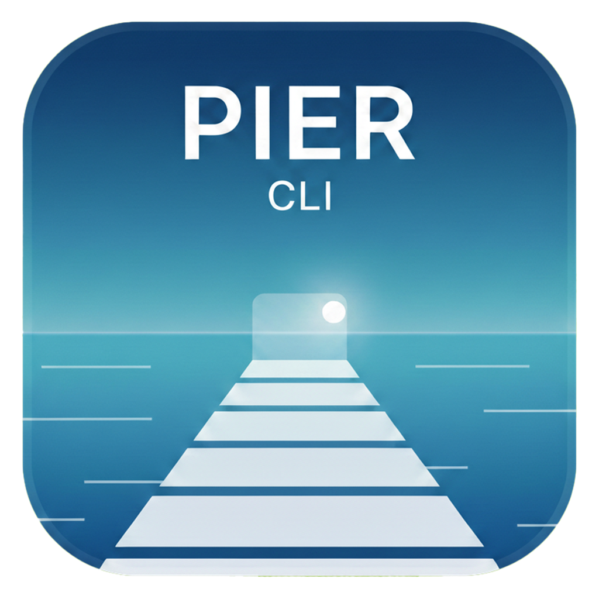

<div align="center">
  
  <h1>Pier-X</h1>
  <p><strong>把终端 / Git / SSH / 数据库 / 远程运维放进一个 IDE 风格工作台的桌面工具。</strong></p>
  <p>
    <a href="README.md">中文</a> ·
    <a href="README.en.md">English</a>
  </p>
</div>

---

Pier-X 是 [Pier](https://github.com/chenqi92/Pier)（仅 macOS）的跨平台继任者：同样的名字、同样的目标——给后端 / 运维工程师一台「不用切应用」的工作台。技术栈换成 **Rust 核心 + Tauri 2 + React + TypeScript**，首发覆盖 **macOS** 与 **Windows**，长期保留 Linux。

> 完整的产品规范见 [docs/PRODUCT-SPEC.md](docs/PRODUCT-SPEC.md)；视觉规范见 [.agents/skills/pier-design-system/SKILL.md](.agents/skills/pier-design-system/SKILL.md)；代码规则见 [CLAUDE.md](CLAUDE.md)。

## 功能一览

界面采用「**左侧 Sidebar + 中心 Tab 工作区 + 右侧工具面板**」的三栏 IDE 布局，每个 Tab 携带自己的「右侧工具偏好」。

### 中心工作区

- **终端**：基于 xterm.js + `pier-core::terminal::PierTerminal`。
  - 三种后端：本地 PTY（forkpty / ConPTY）、SSH shell、已保存的 SSH 连接（自动从系统 keyring 取密码）。
  - 支持 256 / RGB 色、SGR、可视/音频 bell、可配置 scrollback、复制选区 / 粘贴剪贴板、自定义右键菜单。
- **Markdown**：选中左侧 `.md` 文件后自动渲染（pulldown-cmark，CommonMark + GFM）。
- **欢迎页**：无 Tab 时展示常用动作（新建本地终端 / 新建 SSH / 最近连接 / 设置 / 命令面板）。

### 左侧 Sidebar

- **Files**：以家目录为入口，面包屑 + Places 下拉，单击 Markdown 自动右侧预览，双击目录在该目录开本地终端。
- **Servers**：所有已保存 SSH 连接（YAML 文件 + 系统 keyring），支持搜索、编辑、删除；点击直接开 SSH Tab。

### 右侧工具面板（per-Tab 切换）

| 工具 | 适用 | 功能要点 |
|---|---|---|
| **Git** | 任意 | 总览 / diff / 暂存 / 提交 / 推拉 / 分支 / 历史图（`git2` 拓扑）/ stash / tags / remotes / config / rebase / submodules / conflicts |
| **Server Monitor** | SSH | uptime · load · 内存/swap · 磁盘 · CPU% · 进程列表（用户触发刷新，不轮询） |
| **Docker** | 本地 / SSH | Containers / Images / Volumes / Networks / Compose Projects 五类资源；start / stop / restart / remove / inspect / pull / prune / 注册表代理 |
| **MySQL / PostgreSQL** | 任意 | 自动开 SSH tunnel；database / schema / table 三级浏览；CodeMirror SQL 编辑器；结果表 + TSV 导出；**默认只读**，写操作需显式解锁 + 二次确认 |
| **Redis** | 任意 | pattern 扫描 + TTL；string / list / hash / set / zset / stream 详情；命令编辑器；危险命令（FLUSHALL / KEYS \*）二次确认 |
| **SQLite** | 本地 | 选 `.db` 文件；表/列 metadata；查询；同样的只读默认 |
| **Log** | SSH | File / System（syslog / nginx / dmesg / journald / docker）/ Custom 三种日志源；前端 drain 模型，避免事件风暴 |
| **SFTP** | SSH | 远程文件浏览、上传 / 下载（带进度事件）、chmod 对话框、CodeMirror 内嵌编辑器（≤ 5 MB，UTF-8 lossy 替换 + 警告条） |
| **Firewall** | SSH | 自动探测后端（firewalld / ufw / nft / iptables）；Listening / Rules / Mappings / Traffic 四 Tab；写操作**注入到终端**等用户审阅，不静默执行 |
| **Markdown** | 任意 | 渲染左侧选中的 `.md` 文件 |

### 跨功能

- **命令面板**（`⌘K` / `Ctrl+K`）、新建终端（`⌘T`）、新建 SSH（`⌘N`）、关闭 Tab（`⌘W`）、设置（`⌘,`）、Git 面板（`⌘⇧G`）。
- **主题**：`dark` / `light` / `system`，所有视觉值出自 `src/styles/tokens.css` 单一令牌源。
- **i18n**：英文 / 简体中文。
- **凭证**：SSH 密码与 key passphrase 一律走 `pier-core::credentials` → 系统 keyring（macOS Keychain / Windows Credential Manager / Linux secret-service），不写文件、不写日志。
- **SSH Tunnel 管理**：`PortForwardDialog` 列出所有活动 local forward，可手动新增 / 关闭；DB / Log 面板自动开的 tunnel 也在这里。

## 架构

```
┌────────────────────────────────────────────────────┐
│        Tauri 2 + React 19 + TypeScript（shell）     │  src/
├────────────────────────────────────────────────────┤
│              Tauri 命令层（Rust）                    │  src-tauri/
├────────────────────────────────────────────────────┤
│              pier-core（Rust 核心）                  │  pier-core/
├────────────────────────────────────────────────────┤
│  PTY · SSH · SFTP · Git · MySQL · PG · SQLite ·    │
│  Redis · Docker · Server Monitor · Markdown · …    │
└────────────────────────────────────────────────────┘
```

强约束（详见 [CLAUDE.md](CLAUDE.md) §架构边界）：

- `pier-core` 不依赖任何 UI crate（`tauri` / `gpui` / `qt` 都不行）。
- 前端不绕过 Tauri 命令直连 `pier-core`。
- Tauri 命令是「薄壳」，业务逻辑都在 `pier-core`。

## 构建与运行

### 环境

- Node.js 24+、npm 11+
- Rust 1.88+
- Windows 需 WebView2 运行时

### 命令

```bash
npm install                 # 第一次安装前端依赖
npm run tauri dev           # 开发：vite + tauri dev
npm run tauri build         # 发布构建
npm run build:debug         # 带调试符号的构建
cargo build -p pier-core    # 仅构建 Rust 核心
```

### 发布

版本号同步与打 tag 走脚本：

```bash
npm run bump 0.2.0          # 显式版本
npm run bump patch          # patch / minor / major
git push && git push --tags
```

推送 `v*.*.*` 标签触发：

- **GitHub**（`.github/workflows/release.yml`）：构建 Linux / Windows x64 / Windows ARM64 / macOS universal Tauri bundle，发布到 GitHub Releases。
- **Gitea**（`.gitea/workflows/release.yml`）：在 `ubuntu-22.04` runner 上构建 Linux `.deb` / `.rpm` / `.AppImage`，通过 Gitea API 上传到对应 Release。

CI（`.github/workflows/ci.yml`）：Tauri shell 在 macOS + Windows 上构建；Rust 核心在 macOS + Windows + Linux 上 `fmt --check` + `clippy` + `build` + `test`。

## 项目结构

```
Pier-X/
├── Cargo.toml               # Cargo workspace（成员：pier-core、src-tauri）
├── package.json             # 前端入口（npm run tauri …）
├── src/                     # React 前端（active desktop shell）
│   ├── shell/               # TopBar / Sidebar / TabBar / StatusBar / 对话框
│   ├── panels/              # 12 个工具面板（Git / Terminal / SFTP / DB / Docker / …）
│   ├── components/          # 可复用 UI 原子
│   ├── stores/              # zustand 状态
│   ├── lib/                 # Tauri 命令包装、纯函数工具
│   ├── i18n/                # en / zh 资源
│   └── styles/              # tokens.css（视觉单源）+ 各域样式
├── src-tauri/               # Tauri 运行时 + Rust 命令桥
├── pier-core/               # Rust 核心（terminal / ssh / services / …）
├── docs/
│   ├── PRODUCT-SPEC.md      # 产品规范（权威源）
│   └── BACKEND-GAPS.md      # 设计 → 实现差距追踪
├── .agents/skills/          # 设计系统 SKILL 与仓库自动化
├── scripts/bump-version.mjs # 同步版本号 + 打 tag
└── .github/ · .gitea/       # CI / Release workflows
```

## 文档索引

| 文档 | 作用 |
|---|---|
| [docs/PRODUCT-SPEC.md](docs/PRODUCT-SPEC.md) | 产品规范——「Pier-X 是什么、有什么面板、默认行为、不做什么」的权威来源 |
| [docs/BACKEND-GAPS.md](docs/BACKEND-GAPS.md) | 前端设计 → 后端命令的差距清单 |
| [.agents/skills/pier-design-system/SKILL.md](.agents/skills/pier-design-system/SKILL.md) | 视觉令牌（颜色 / 排版 / 间距 / 圆角 / 阴影）唯一来源 |
| [CLAUDE.md](CLAUDE.md) | 给 AI / 协作者的代码规则与架构边界 |
| [pier-core/README.md](pier-core/README.md) | Rust 核心 crate 的对外契约 |

## License

MIT © 2026 [kkape.com](https://kkape.com)
